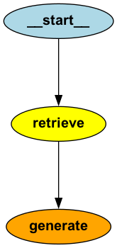

# FinQA: A Question-Answering Solution for Financial Reports

This repository implements a solution for question answering over financial reports using the ConvFinQA dataset. For more details about the dataset, refer to the original repository: [ConvFinQA GitHub Repository](https://github.com/czyssrs/ConvFinQA/).

## System Architecture

The solution employs a Retrieval-Augmented Generation (RAG) system, which integrates Large Language Models (LLMs) with traditional retrieval mechanisms to answer questions about specific sources of information. The architecture consists of three primary components:

1. **Indexing**: Processes and encodes documents into numerical representations (embeddings) and stores them in an index for efficient retrieval.
2. **Retrieval**: Handles user queries at runtime by retrieving the most relevant information from the indexed documents.
3. **Generation**: Utilizes the LLM to generate answers based on the retrieved documents and the user’s question.

### Indexing

The indexing phase includes several key steps:

#### Data Loading

The system loads data from the `train.json` file into memory and preprocesses it to standardize key structures. Specifically, the dataset contains question-answer fields with inconsistent naming conventions: some samples use `qa_0` and `qa_1`, while others use `qa`. To ensure uniformity, all single-field instances of `qa` are renamed to `qa_0`, enabling seamless iteration over dataset elements.

For implementation details, see the `data_loader.py` module.

#### Splitting

Reports are divided into chunks, with each chunk corresponding to a single element from the "pre_text" or "post_text" arrays. Additionally, each table within the report is treated as a unique chunk.

#### Embeddings

The solution uses the `OpenAIEmbeddings` model (specifically, `text-embedding-3-large`) to convert each document chunk into a numerical representation. For tables, the content is first converted to a string format where each line represents a table row before embeddings are generated.

#### Storing

Documents are stored in a vector store to facilitate efficient retrieval. For this prototype, an in-memory vector store (`InMemoryVectorStore`) is employed, as the focus is on conducting local analyses of the solution’s performance. However, for scalability and production-readiness, a more robust and efficient vector store, such as OpenSearch, should be adopted.

For details on splitting, embedding, and storing processes, refer to the `indexing.py` module.

### Retrieval & Generation

The retrieval and generation steps are orchestrated using a graph-based approach, which sequences the two steps: retrieval followed by generation.

<figure>
  <p align="center">
    
  </p>
  <p align="center">Figure 1: Simple graph for QA retrieval-generation</p>
</figure>

#### Retrieval

The retrieval process leverages the similarity search functionality of the `InMemoryVectorStore`. This functionality computes cosine similarity between the query vector and the document embeddings stored in the vector store to identify the top-k most relevant documents. Several approaches were explored for the retrieval step:

- **Approach 1**: Perform similarity search with a default value of `k=4` on documents derived from the `pre_text` and `post_text` paragraphs, while always including the table (retrieved by ID) as an additional document. This results in a total of five documents. However, this approach has limitations in generalizing to financial reports containing multiple tables.
- **Approach 2**: Perform similarity search across all documents, including the table document, and allow the similarity search to determine the top-k documents. In this approach, `k` is set to `8` to improve recall. This method was selected for the final solution due to its ability to generalize effectively to reports with multiple tables.

Detailed results comparing these two approaches can be found in the *Experiment Setup & Results* section.

#### Generation

In the generation step, an LLM is utilized to formulate the final answer to the user’s query. The chosen prompt, `rlm/rag-prompt`, is sourced from the LangChain hub, which offers a variety of task-specific prompts. The prompt provides a concise description of the task and takes the user’s query and retrieved documents as input context.

```
You are an assistant for question-answering tasks. Use the following pieces of retrieved context to answer the question. If you don't know the answer, just say that you don't know. Use three sentences maximum and keep the answer concise.

Question: {question} 

Context: {context} 

Answer:
```

For the model, experiments were conducted using both `gpt-4o-mini` and `gpt-4o`. While `gpt-4o-mini` demonstrated strong mathematical reasoning capabilities, `gpt-4o`, with its larger parameter size (1.8 trillion vs. ~10 billion for `gpt-4o-mini`), yielded superior results. Consequently, `gpt-4o` was selected for the final solution.

Further details and performance comparisons can be found in the *Experiment Setup & Results* section.

### Inference

Functionality has been implemented to support inference on both individual reports and batches of reports. For each report, the indexing and storing steps are performed dynamically, as the objective is to process each report independently. 

If the solution were extended to retrieve information across the entire dataset, it would be more efficient to compute the indexing and storing steps offline. This approach would save both time and resources by eliminating the need to recompute embeddings repeatedly. 

The results of the inference process are saved in the `/results` folder.

## Evaluation

To evaluate the accuracy of the answers generated by the solution, an LLM-based evaluation approach was employed. The evaluation prompt, sourced from the LangChain hub (`langchain-ai/rag-answer-vs-reference`), takes as input the question, ground truth answer, and generated answer. It assigns a score of `0` for incorrect answers, `1` for correct answers, and provides a brief explanation for the score.

To enhance the granularity of the evaluation, the prompt was modified to include a score of `0.5` for relevant answers containing minor approximation errors (within ±0.5). This custom prompt can be found in `prompt.py`.

Finally, a detailed evaluation report was generated. The report summarizes the evaluation results, including the count and percentage of samples for each score category.


## Experiment Setup & Results

Three different approaches were evaluated using the previously described evaluation framework. Each approach was tested on the first 1000 financial reports from `train.json` to control resource costs.

### Experiment 1

This experiment involved performing similarity search with a default value of `k=4` on documents derived from the `pre_text` and `post_text` paragraphs, while always including the table (retrieved by ID) as an additional document. This resulted in a total of five documents. As anticipated, this approach showed limitations in generalizing to financial reports containing multiple tables. The LLM used for the generation step in this experiment was `gpt-4o-mini`.

| Score | Count | Percentage (%) |
|-------|-------|----------------|
| 0.0   | 307   | 30.7           |
| 0.5   | 223   | 22.3           |
| 1.0   | 470   | 47.0           |

*Table 1: Distribution of scores for the first proposed approach.*


Representative **examples** of answers evaluated by the LLM and assigned a **score of 0.5**:


| Question | Actual Answer | Expected Answer | Score | Explanation |
|----------|---------------|-----------------|-------|-------------|
| what is the percent increase in cash and cash equivalents from year 2009 to 2010? | "The cash and cash equivalents at the end of fiscal year 2009 were $364,221,000, and at the end of fiscal year 2010, they were $453,257,000. The percent increase can be calculated as ((453,257 - 364,221) / 364,221) * 100, which equals approximately 24.5%." | 24.4% | 0.5 | "The student's answer provides the correct methodology for calculating the percent increase in cash and cash equivalents, which is a positive aspect. However, the calculated result of approximately 24.5% does not match the ground truth answer of 24.4%. Given the slight discrepancy, the answer is factually accurate in its approach but has a minor calculation error, leading to a score of 0.5." |
| what was the percent of the growth in the revenues from 2005 to 2006 | "The revenue in 2005 was $50,583 and in 2006 it was $73,501. To calculate the growth percentage: \[(73,501 - 50,583) / 50,583 \times 100\] which equals approximately 45.2%. Therefore, the percent of the growth in revenues from 2005 to 2006 was about 45.2%." | 45.3% | 0.5 | "The student provided a calculation for the growth percentage that is close to the ground truth answer of 45.3%, with their result being approximately 45.2%. Although this is accurate within a margin of ±0.5%, the answer does not match the ground truth exactly, which affects the score. However, the student did not present conflicting statements and their calculations were clear and accurate." |
| what is the growth rate in operating profit for aeronautics in 2012? | "The growth rate in operating profit for aeronautics in 2012 compared to 2011 was approximately 4%, as the operating profit increased by $69 million." | 4.2% | 0.5 | "The student's answer contains a growth rate of approximately 4% which is close to the correct answer of 4.2%. This falls within the acceptable margin of ±0.5 for a score of 0.5. However, since the exact growth rate is not provided and the student states 'approximately 4%' instead of the precise figure, it does not fully satisfy the criteria for a score of 1." |

Results from this experiment indicate that **69.3% of the answers were relevant**. Among these, 22.3% were affected by minor approximation discrepancies between the actual answer and the ground truth.

### Experiment 2

In this experiment, similarity search was performed across all documents, including the table document, allowing the similarity search to determine the top-k documents. Here, `k` was set to `8` to enhance recall. Given the concise nature of the documents, this configuration remained computationally reasonable. The LLM used in this experiment was again `gpt-4o-mini`.

| Score | Count | Percentage (%) |
|-------|-------|----------------|
| 0.0   | 328   | 32.8           |
| 0.5   | 190   | 19.0           |
| 1.0   | 482   | 48.2           |

*Table 2: Distribution of scores for the second proposed approach.*

Results from this experiment closely resemble those of the first, with **67.2% of the answers being relevant** and 19.0% of these exhibiting minor approximation errors. The increased `k` value (8) improved the likelihood of including all relevant information, such as the table, in the context.

### Experiment 3

The final experiment retained the same retrieval configuration as Experiment 2 but used `gpt-4o` as the LLM for generation. The larger, more capable model was expected to yield more accurate results when provided with sufficient context.

| Score | Count | Percentage (%) |
|-------|-------|----------------|
| 0.0   | 282   | 28.2           |
| 0.5   | 153   | 15.3           |
| 1.0   | 565   | 56.5           |

*Table 3: Distribution of scores for the third proposed approach.*

This configuration delivered the best results, with **71.8% of the answers being relevant** and only 15.3% of these affected by minor approximation errors. These results demonstrate that the retrieval step is effectively including relevant context in the prompt. Additionally, the improved mathematical and reasoning capabilities of the larger `gpt-4o` model contributed significantly to better performance. This highlights the potential for further advancements by leveraging more powerful models in the generation step.

## Future Work

The following section outlines potential next steps and areas for future development.

### Enhancement of the Evaluation Framework

A possible enhancement to the evaluation framework could involve separating the evaluation of the indexing and retrieval process from that of the generation component.

The evaluation of the indexing and retrieval phase can be conducted using standard information retrieval metrics, such as:
- **Precision@k**: Measures the proportion of relevant items correctly identified within the top K recommendations relative to the total number of relevant items in the dataset.
- **Recall@k**: Assesses how many relevant items were retrieved compared to the total number of relevant items present in the entire dataset.
- **F1-Score**: Represents the harmonic mean of precision and recall, offering a balanced metric for evaluating both aspects.

In the absence of ground-truth relevant documents, a Large Language Model (LLM)-based approach could be employed to assess the relevance of documents based on the given query and retrieved documents. An example prompt for this task is `langchain-ai/rag-document-relevance`.

### Incorporating Message History

To facilitate a back-and-forth conversation with the user, the application must incorporate a mechanism for retaining past questions and responses, enabling the system to use this "memory" in its current reasoning process.

This can be achieved by utilizing a simple in-memory checkpoint saver (e.g., `MemorySaver`) and passing it as an input argument when compiling the graph. This would enable conversational capabilities within the application.

Example:
```
graph = builder.compile(checkpointer=MemorySaver(), store=in_memory_store)
```

To accommodate concurrent users, we could introduce a configuration that includes a thread ID or user ID, which would be passed alongside the user input during inference:

```
config = {"configurable": {"thread_id": "1", "user_id": "2"}}
```

For production environments, a suitable database such as DynamoDB could be employed to store message history.
